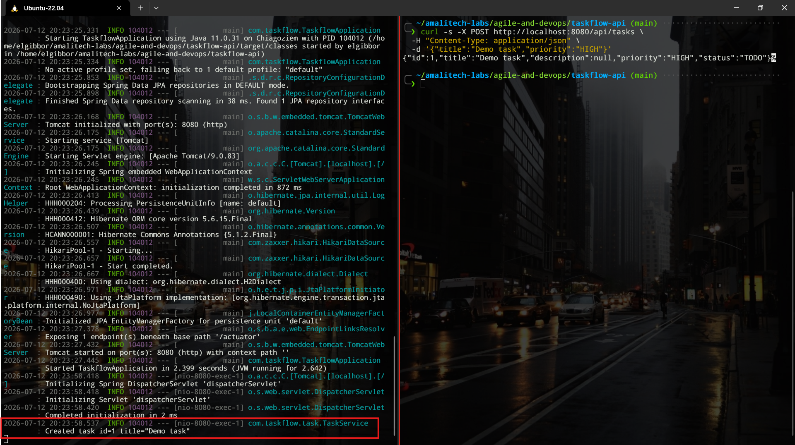
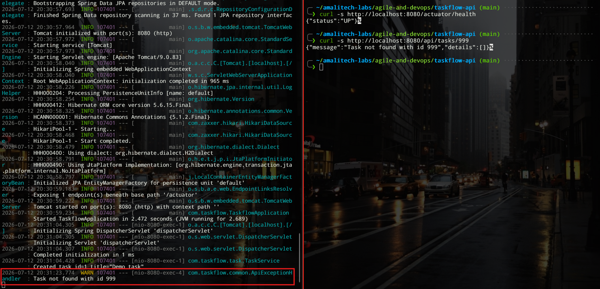

# Sprint 2 Review

## Goal

My goal for this sprint was to deliver the two backlog items I added during Sprint 2 refinement, a health check endpoint and logging for key task operations, since I've put the CI pipeline in place during the end of Sprint 1.

## What I delivered

I completed both stories.

| # | Story | Evidence |
|---|-------|----------|
| 5 | Health check endpoint | GET to /actuator/health returns a 200 response with status UP |
| 6 | Log key task operations | Task creation and status updates are logged at INFO level, and validation, not found, and malformed request errors are logged at WARN level |

For story 5 I added the Spring Boot Actuator dependency instead of writing a custom health endpoint by hand. It gave me a working health check with a single dependency and no extra code.

For story 6 I added a logger to TaskService and logged when a task is created and when its status is updated, including the task id so the log line is actually useful for tracing what happened. I added a second logger to ApiExceptionHandler and logged a warning for each of the three error cases it handles, validation failures, not found errors, and malformed request bodies.

## Demo

Verified the following behavior by running the application and hitting it directly.

1. Posting a valid task to /api/tasks returns a 201 response, and the console prints an INFO line showing the created task's id and title.
2. Getting /actuator/health returns a 200 response with a body of status UP.
3. Getting /api/tasks/{id} for an id that does not exist returns a 404 response, and the console prints a WARN line showing the missing id.

This time I ran the actual application locally for this demo rather than only relying on tests, since logging output is something I wanted to see with my own eyes in the console, not just assert against in a test.

## Test evidence

I have 17 automated tests, all passing when I run mvn test. That is 9 integration tests in TaskControllerIntegrationTest, 7 unit tests in TaskServiceTest, and 1 integration test in the new HealthCheckIntegrationTest. I did not write an automated test asserting on log output itself, since that would have meant introducing a Logback test appender, which felt like more complexity than this stage of the project needed. Instead I verified the logging manually by running the application and reading the console output.

The raw results from this run, including the Surefire report for each test class, are saved in docs/evidence/test-results.txt. A real passing run of the CI pipeline on GitHub Actions is saved in docs/evidence/ci-run-12cc514.log, pulled directly from the workflow run.
## Commit history

I kept the same small, single purpose commit habit from the end of Sprint 1 going all the way through Sprint 2. Story 5 was three commits, the dependency, the test, and I confirmed the build compiled before committing either one. Story 6 was two commits, one for the TaskService logging and one for the ApiExceptionHandler logging, and I ran the full test suite before each commit rather than after.
