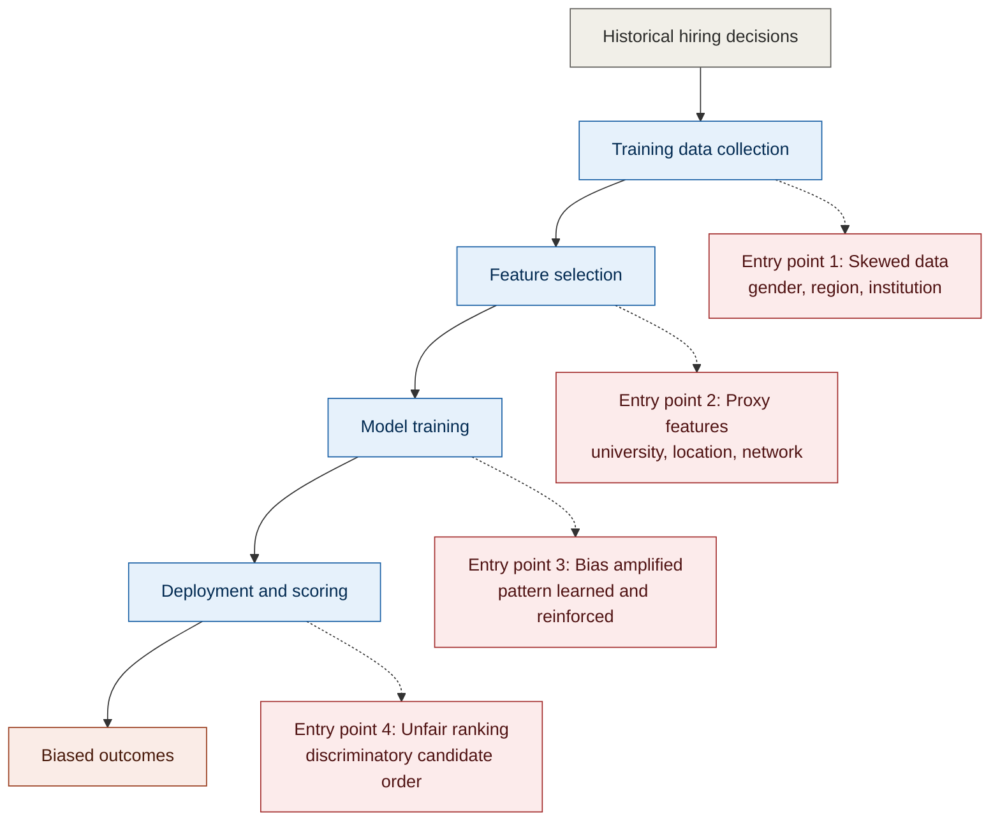

# Bias Investigation Report

**Project:** HireScore AI Bias Analysis  
**Role:** Quality Assurance Engineer, TalentMatch AI  
**Governing Framework:** Law No. 058/2021 of 13 October 2021 Relating to the Protection of Personal Data and Privacy (Republic of Rwanda), supervised by the National Cyber Security Authority

> **Note on jurisdiction.** The original scenario referenced Ghana's Data Protection Act. This submission localises the analysis to Rwanda's Law No. 058/2021, in accordance with the instruction that our cohort apply the Rwandan framework while studying this module. The most directly relevant provision is the data subject's right not to be subject to a decision based solely on automated processing.

---

## 1. Executive Summary

**Bias severity:** High.

HireScore was trained on the company's historical hiring decisions and scores candidates using several features that act as indirect indicators of socioeconomic background. The investigation finds that the system reproduces, and at the ranking stage amplifies, patterns of disadvantage present in the historical data. The rating of High is warranted because the bias is not confined to a single feature or stage; it originates in the training data, is carried forward by the choice of features, is learned during training, and is expressed in the final ranking. Bias that is present at every stage of the pipeline is systemic rather than incidental, and systemic bias in a system that influences employment decisions carries both a high likelihood of harm and a high severity of harm.

The groups most affected are female candidates, candidates from institutions outside a small set of well represented universities, and candidates from regions outside the two dominant regions in the training data.

**Three most urgent actions:**

1. Remove or reduce the weight of proxy features, in particular university attended, prior employment location, and number of professional network connections.
2. Retrain the model on a balanced and representative dataset.
3. Introduce fairness monitoring, with a recurring audit of selection rates across demographic groups.

---

## 2. Detailed Findings

### 2.1 Bias Type Analysis

#### 1. Historical Bias

**Present:** Yes.

**Evidence:** The training data records that 72 percent of past hires were male and 28 percent were female, alongside an overrepresentation of a small number of universities and regions.

**Explanation:** Historical bias arises when the training data accurately records decisions taken in a world that was already unequal. The data is not corrupted, mislabelled, or badly sampled; it is a faithful record of what actually happened. The difficulty is that the reality it records was itself unfair, so a model that learns to reproduce past decisions will treat historical disadvantage as though it were a legitimate predictor of merit. Removing the gender field does not remove this bias, because the historical pattern does not live only in the gender column. It is distributed across the other features that correlate with gender in the data, such as which universities, companies, and roles appear in successful past applications. The model can therefore continue to reconstruct the gendered pattern from those correlated features even when gender itself is absent.

#### 2. Sampling Bias

**Present:** Yes.

**Evidence:** The training set is dominated by Software Engineering roles at roughly 60 percent, with other job categories thinly represented, and candidates are concentrated in a small number of regions.

**Explanation:** Sampling bias arises when the data used to train the model is not representative of the population to which the model will actually be applied. Even if every individual record were fair, the imbalance means the model has seen many examples of some groups and roles and very few of others. Its scoring is therefore well calibrated for the well represented groups and unreliable for the rest. A concrete example is a candidate applying for a non technical role from an underrepresented region. The model has seen few such candidates in training, so it has learned little about what success looks like for that profile, and its score for that candidate rests on weak evidence. The harm is not that the model is deliberately unfair to that candidate, but that it is simply less competent to judge them, and that incompetence falls unevenly on those already underrepresented.

#### 3. Measurement Bias

**Present:** Yes.

**Evidence:** Features such as the number of professional network connections and the availability of references vary with a candidate's access and opportunity rather than with ability.

**Explanation:** Measurement bias arises when the feature the model measures is a flawed stand in for the quality it is actually meant to capture. HireScore treats the size of a candidate's professional network as a signal of professional strength, but network size largely reflects prior access, exposure, and the norms of a candidate's environment rather than their capability. The same measured value therefore means different things for different candidates. Contrast this with years of experience or demonstrated skills, which are closer to direct measures of a candidate's capacity to perform the role. Years of experience is not a perfect measure, but it is a far more honest proxy for ability than network size, because it is less determined by the accident of a candidate's starting circumstances.

#### 4. Proxy Bias

**Present:** Yes.

**Proxy features:** University attended, prior employment location, number of professional network connections, previous company names.

**Explanation:** Proxy bias arises when a feature that appears neutral quietly encodes a protected or sensitive attribute. University attended, for instance, correlates strongly with socioeconomic background and region, so a model that relies on it can discriminate on those grounds even though neither background nor region is named as an input. This is the reason that simply deleting a sensitive field is an insufficient fix. When a protected attribute is removed but its proxies remain, the model reconstructs the attribute from the proxies and continues to discriminate, now invisibly and with the false reassurance that the sensitive field is gone. Effective mitigation must therefore address the proxies themselves, not only the explicit sensitive attribute, because it is the proxies that carry the discrimination forward.

### 2.2 Bias Pipeline Mapping

The diagram below traces where each type of bias enters the system, from the historical decisions that seed the data through to the ranking output.

The mapping shows why remediation at a single point is inadequate. Cleaning the data addresses Entry Point 1 but not the proxy features admitted at Entry Point 2. Removing proxy features addresses Entry Point 2 but does nothing for a model already trained on skewed data at Entry Point 3. A durable solution therefore intervenes at more than one point, which is the logic behind the staged mitigation plan in Section 3.

### 2.3 Feature Risk Analysis

| Risk Level | Features | Basis for Rating |
|---|---|---|
| **High** | University attended, prior employment location, professional network connections, previous company names | Act as proxies for socioeconomic background, region, and access rather than ability. |
| **Moderate** | References, extracurricular activities | Correlate with opportunity and exposure, though less strongly than the high risk features. |
| **Low** | Skills, years of experience | Relate more directly to a candidate's capacity to perform the role. |

The placements are ordered by how closely each feature measures ability itself, as opposed to the circumstances surrounding a candidate. High risk features measure access and background; low risk features measure capability. References and extracurricular activities sit between the two, because they carry some genuine signal about a candidate while still being shaped by opportunity, and so they warrant scrutiny rather than removal.

---

## 3. Mitigation Plan

### 3.1 Immediate Actions, within one week

- **Feature remediation:** remove or reduce the weight of university attended, prior employment location, and professional network connections.
- **Threshold review:** introduce fairness aware scoring thresholds to bring selection rates across groups into closer balance.
- **Output monitoring:** begin tracking, on a recurring basis, the gender selection ratio, the regional distribution of ranked candidates, and the average score by demographic group.

### 3.2 Short Term Actions, one to three months

- **Data collection:** gather more diverse and representative training data, deliberately including underrepresented groups, regions, and job categories.
- **Model retraining:** retrain on the balanced dataset using fairness aware techniques.
- **Human oversight:** introduce manual review of top ranked candidates. This is not only good practice. Under Law No. 058/2021 the data subject has the right not to be subject to a decision based solely on automated processing, so a meaningful human step in the decision is a legal safeguard as well as a fairness measure.

### 3.3 Long Term Actions, six to twelve months

- **Fairness metric:** adopt Equal Opportunity as the primary fairness metric, with Demographic Parity retained as a secondary comparison.
- **Process change:** limit over reliance on the AI ranking by embedding hybrid decision making that combines the model's output with human judgement.
- **Transparency:** inform candidates that an automated system is used, explain the scoring criteria in general terms, and provide a route to request review or to appeal a decision.

**On the fairness metric choice.** The report recommends Equal Opportunity over Demographic Parity. Demographic Parity requires that each group be selected at the same overall rate, which, applied rigidly, can require selecting less qualified candidates from one group in order to match the selection rate of another. Equal Opportunity instead requires that candidates who are genuinely qualified have an equal chance of being selected regardless of the group they belong to. For a hiring context this is the more defensible target, because it protects fairness among those able to perform the role without compelling selection on the basis of group membership alone. Demographic Parity is retained as a secondary comparison because a large gap in overall selection rates remains a useful warning signal, even when it is not the primary objective.

---

## 4. Success Metrics

- A reduced score gap between demographic groups across successive audits.
- Balanced representation among top ranked candidates.
- Improved diversity across actual hires.
- Recurring fairness reports showing consistent, sustained improvement rather than a single point in time correction.

---

## 5. Timeline

| Phase | Timeframe | Key Actions |
|---|---|---|
| Immediate | Week 1 | Feature remediation, monitoring setup |
| Short term | One to three months | Data balancing, retraining, human oversight |
| Long term | Six to twelve months | Fairness metric adoption, transparency measures |

---

## 6. Conclusion

HireScore exhibits significant bias risk, driven by historical data, proxy features, and an unrepresentative sample. Left unaddressed, the system would reproduce and scale existing inequality in hiring outcomes while exposing TalentMatch AI to non compliance with the automated decision making safeguards of Law No. 058/2021. The investigation concludes that the appropriate response is not a single corrective action but a staged programme that intervenes at several points in the pipeline, combining data remediation, proxy feature control, human oversight, and continuous fairness monitoring. Pursued together, these measures move HireScore from a system that quietly entrenches disadvantage toward one that can be trusted, defended, and shown to treat candidates fairly.
